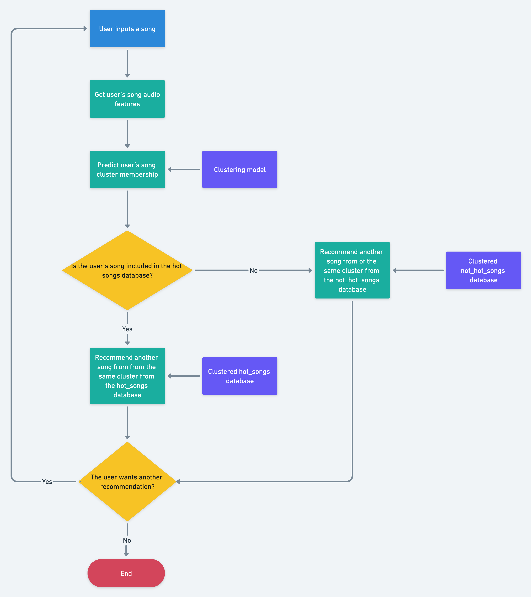

# Song App

## Overview
I created an App song recommender based on the features of the songs. 
You can find the app at https://dashboard.heroku.com/apps/song-app-jzar

## Contents

- App
`src/app.py` - This is the main app, it runs in streamlit

- Libraries
1. `src/spoty_jzar.py` - This is the class that is used as a Spotify interface
2. `src/music_jzar.py` - this lib is used to scrap and get the raw lists
3. `src/cluster_jzar.py` - this lib is used for clustering functions

## Databases

- I used a scrapper to get the 100 hot songs from 
- For the big dataset I used https://song-app-jzar.herokuapp.com/

## Requirements

- beautifulsoup4==4.10.0
- matplotlib==3.3.4
- numpy==1.19.5
- pandas==1.4.1
- requests==2.25.1
- scikit_learn==1.0.2
- scipy==1.6.0
- seaborn==0.11.2
- spotipy==2.19.0
- streamlit==1.8.0

## Schema

This is the schematic of the song recommender

